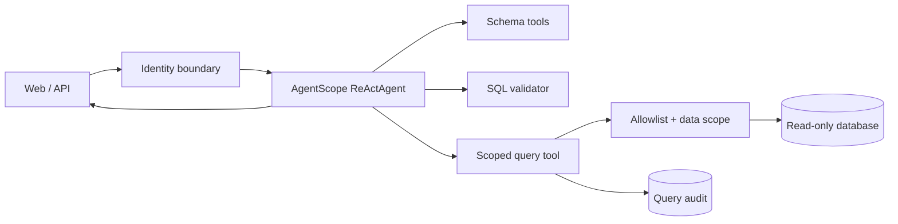

# Qiqi DataAgent

Qiqi DataAgent 是一个基于 AgentScope Java 的数据分析智能体。用户用自然语言提问，Agent 会查看真实表结构、生成并校验只读 SQL、按服务端身份施加数据范围、执行查询，再输出带 `queryId` 证据的分析结果。

这个仓库是独立项目，拥有自己的构建、示例数据、测试和 Git 历史。代码、提示词、页面和销售示例数据均为本项目重新设计，没有复制课程项目的源码或静态资源。

## 当前可运行能力

- AgentScope Java 2.0.3 ReAct 循环与 DashScope 流式模型。
- 表清单和真实 JDBC 元数据探查工具。
- 单条只读 SQL 校验、表白名单、危险函数拦截和强制 `LIMIT`。
- 服务端身份绑定；模型不能通过工具参数指定或伪造用户身份。
- `ALL` 和 `DEPARTMENT` 两种数据范围；订单行必须通过订单主表的合法关联接受部门约束。
- JDBC 查询超时、最大行数和只读连接标记。
- 查询审计：记录 `queryId`、用户、会话、最终 SQL、耗时和执行状态。
- SSE 流式接口和一个无前端构建依赖的聊天页面。
- 响应式分析工作台：流式 Markdown 报告、可横向滚动的表格、SQL 复制、报告下载和查询证据。
- 支持快捷问题、停止生成、新建分析和历史切换；不同对话可同时生成，后台完成后显示新回复提示。
- 停止按钮仅影响当前对话；删除生成中的对话会停止其请求。请求进行期间暂不切换演示身份。
- 原创 H2 销售数据，开箱即可验证 SQL、安全策略和部门隔离。

当前身份入口 `X-Qiqi-User` 是本地演示适配器，用来验证 Agent 运行时身份传播，不是生产登录方案。公开部署前必须替换成 SSO、JWT 或企业网关认证，并为业务库配置数据库级只读账号。

## 架构



`ReActAgent` 按请求创建，避免共享可变运行状态；会话状态存储由应用共享，并以服务端确认的 `userId + sessionId` 隔离。同步 JDBC 工具在 Reactor 的弹性线程池执行，不阻塞 WebFlux 事件线程。

## 跟着项目学习 AgentScope 2.0

学习时先不要通读整个框架。第一课从一条真实请求入手，只看 Agent 的创建、`RuntimeContext` 和工具交接：

- [第一课：一次请求怎样进入 AgentScope](docs/learning/01-agent-runtime-entry.md)

## 本地运行

要求：JDK 21、Maven 3.9+、一个 DashScope API Key。

```bash
export DASHSCOPE_API_KEY="your-key"
mvn spring-boot:run
```

访问 [http://localhost:8080](http://localhost:8080)。可以切换三个演示身份：

| 用户 | 数据范围 | 用途 |
| --- | --- | --- |
| `admin` | 全部数据 | 查看完整结果 |
| `alice` | North Sales（部门 10） | 验证北区过滤 |
| `bob` | South Sales（部门 20） | 验证南区过滤 |

建议问题：

```text
对比 2026 年 1 月和 2 月已付款收入，并按部门解释变化，给出查询证据。
```

没有 API Key 时应用仍可启动，页面、数据和自动化测试可用；聊天接口会返回清楚的配置错误。

### 使用 OpenAI 兼容网关

在项目根目录创建 `application-local.yml`（已被 Git 忽略），填写网关配置：

```yaml
qiqi:
  model:
    provider: openai
    base-url: https://your-gateway.example/v1
    api-key: "your-key"
    name: your-model-id
```

通过 `mvn spring-boot:run -Dspring-boot.run.profiles=local` 加载该配置。
也可使用 `QIQI_MODEL_PROVIDER`、`QIQI_MODEL_BASE_URL`、`QIQI_MODEL_API_KEY` 和
`QIQI_MODEL` 环境变量。默认仍使用 DashScope；兼容网关使用 Bearer 认证，
模型 ID 以网关的模型列表为准，需支持流式回复和工具调用。不要提交真实密钥。

## API

流式聊天：

```bash
curl -N http://localhost:8080/api/chat/stream \
  -H 'Content-Type: application/json' \
  -H 'X-Qiqi-User: alice' \
  -d '{"query":"统计每月已付款收入","conversationId":"demo-1"}'
```

运行信息与演示用户：

```bash
curl http://localhost:8080/api/meta
```

## 验证

```bash
mvn test
```

前端回归检查（Node.js 22.13+；仅测试需要，运行应用无需 Node.js）：

```bash
npm --prefix src/test/frontend ci
npm --prefix src/test/frontend test
```

覆盖 Markdown 表格和代码块、HTML 清理、跨分片 UTF-8/SSE、查询证据、身份切换、
网络错误、连接中断、停止生成和重复提交。Markdown 依赖随项目本地分发，不依赖运行时 CDN。
对话自动保存在当前浏览器的 localStorage 中，按演示身份分开显示；支持刷新恢复、历史切换和删除。
记录包含问题、回答、执行过程及查询证据，不跨浏览器同步；升级前未保存的对话无法恢复。
服务端 Agent 上下文仍使用内存存储，服务重启后历史报告可以查看，但模型不会保留重启前的上下文。
也可通过「下载报告」保存 Markdown。

测试覆盖以下边界：

- DML、多语句、注释、锁、未公开表和危险函数拒绝。
- 直接、嵌套和 CTE 查询的部门条件注入。
- 订单明细绕过、笛卡尔关联和带 `OR` 的放宽关联拒绝。
- 同一聚合在管理员、北区、南区身份下返回不同且确定的结果。
- 未知身份在 Agent 运行前拒绝。
- 未配置模型密钥时应用仍能启动和提供静态页面。

## 配置

主要配置在 `src/main/resources/application.yml`：

| 配置 | 默认值 | 说明 |
| --- | --- | --- |
| `DASHSCOPE_API_KEY` | 空 | DashScope 模型密钥 |
| `QIQI_MODEL` | `qwen-plus` | 模型名 |
| `qiqi.model.max-iterations` | `12` | 单次 ReAct 最大迭代 |
| `qiqi.query.max-rows` | `200` | 查询结果硬上限 |
| `qiqi.query.timeout` | `10s` | JDBC 查询超时 |
| `qiqi.exposed-tables` | 五张示例业务表 | Agent 可见表白名单 |

接真实数据库时，覆盖 `spring.datasource.*`，关闭示例初始化，并维护表白名单：

```yaml
spring:
  sql:
    init:
      mode: never
  datasource:
    url: jdbc:mysql://localhost:3306/your_database
    username: qiqi_readonly
    password: ${QIQI_DB_PASSWORD}
```

当前部门范围规则针对示例订单模型：事实表是 `sales_order`，明细表是 `sales_order_item`。接入其他业务模型前，应为新事实表实现明确的范围规则和绕过测试，不能仅把表名加入白名单。

## 后续路线

第一阶段已经建立独立、可运行的安全查数闭环。下一步按以下顺序扩展，同时保持每项都有行为验证：

1. 持久化会话、中断与恢复、稳定的前端事件协议。
2. 业务术语和指标层，避免同一指标出现多种 SQL 口径。
3. 文件上传、小文件直读、大文件 RAG 与图片理解。
4. MCP 联网和图表、Skills 管理。
5. 正式认证、角色和部门管理、PostgreSQL/MySQL 数据范围适配。
6. 可观测性和参赛演示报告。

Agent 自动评分和 BIRD 数据集评测暂不在当前范围；安全与功能回归测试会持续保留。

## 公开发布

仓库使用 [Apache License 2.0](LICENSE)。提交 GitHub 前请确认历史中没有 API Key、真实数据库地址、公司数据或课程受限资源。项目依赖 [AgentScope Java](https://github.com/agentscope-ai/agentscope-java)、Spring Boot、JSqlParser、H2 等第三方开源组件，各自遵循其许可证。
